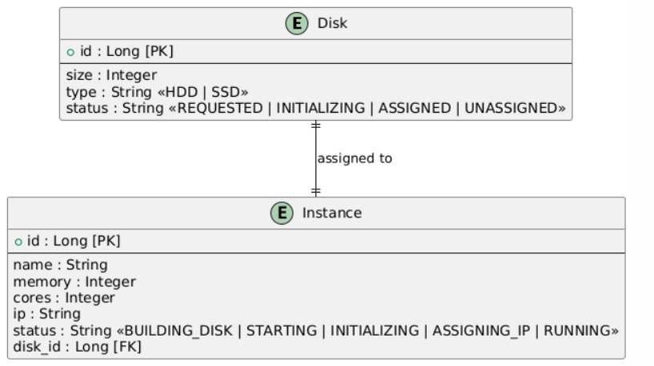
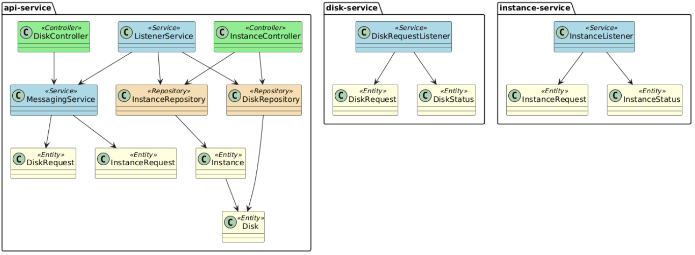

# 🏢 CPD Management System - Distributed Application

Proyecto para la asignatura **Desarrollo de Aplicaciones Distribuidas** (3º Ingeniería de Computadores).  
Desarrolla una **aplicación web distribuida** para la gestión de un centro de proceso de datos (CPD), aplicando tecnologías modernas y buenas prácticas profesionales.

---

## 📚 Índice

1. [🔎 Descripción General](#-descripción-general)
2. [🗺️ Arquitectura del Sistema](#-arquitectura-del-sistema)
3. [⚙️ Puesta en Marcha](#️-puesta-en-marcha)
4. [🌐 Endpoints de la API](#-endpoints-de-la-api)
5. [🗄️ Esquema de la Base de Datos](#️-esquema-de-la-base-de-datos)
6. [🔁 Flujo Funcional](#-flujo-funcional)
7. [🔄 Comunicación y Balanceo](#-comunicación-y-balanceo)
8. [🔧 Variables de Entorno y Configuración](#-variables-de-entorno-y-configuración)
9. [🧪 Colección Postman](#-colección-postman)
10. [👥 Equipo y Contribuciones](#-equipo-y-contribuciones)
11. [📊 Diagramas del Sistema](#-diagramas-del-sistema)
12. [📎 Recursos y Enlaces](#-recursos-y-enlaces)

---

## 🔎 Descripción General

Este sistema permite gestionar instancias virtuales y discos de un CPD de forma distribuida, soportando concurrencia, balanceo de carga y comunicación asíncrona entre microservicios.

---

## 🗺️ Arquitectura del Sistema

El sistema está compuesto por los siguientes microservicios y componentes:

- **`apiservice1` y `apiservice2`**: Exponen la API REST para gestionar instancias y discos. Balanceados por HAProxy.
- **`disk-service`**: Gestiona la creación y el ciclo de vida de los discos de forma asíncrona.
- **`instance-service`**: Gestiona la creación y el ciclo de vida de las instancias virtuales.
- **`MySQL`**: Base de datos relacional para persistencia.
- **`RabbitMQ`**: Broker de mensajería para comunicación asíncrona entre servicios.
- **`HAProxy`**: Balanceador de carga HTTP para los servicios de API.

Todos los servicios se ejecutan en contenedores Docker y se orquestan con Docker Compose.

---

## ⚙️ Puesta en Marcha

### 1️⃣ Requisitos previos

- Docker y Docker Compose instalados
- (Opcional) Java 17+ y Maven para desarrollo local

### 2️⃣ Clonar el repositorio

```bash
git clone <url-del-repo>
cd DAD_Practice_1-1
```

### 3️⃣ Arrancar todos los servicios

```bash
docker-compose up --build
```

### 4️⃣ Acceso a la aplicación

- API disponible en: [http://localhost/](http://localhost/) (a través de HAProxy)
- Todos los endpoints están documentados abajo.

---

## 🌐 Endpoints de la API

### 📦 Instancias

- `GET /api/instances`  
  Lista todas las instancias (paginado).

- `GET /api/instances?id=1`  
  Obtiene una instancia por ID.

- `POST /api/instances`  
  Crea una nueva instancia.  
  **Body ejemplo:**
  ```json
  {
    "name": "Mi instancia",
    "memory": 2048,
    "cores": 2,
    "diskType": "SSD",
    "diskSize": 100
  }
  ```

- `DELETE /api/instances?id=1`  
  Elimina una instancia por ID.

---

### 💽 Discos

- `GET /api/disks`  
  Lista todos los discos (paginado).

- `GET /api/disks?id=1`  
  Obtiene un disco por ID.

- `POST /api/disks`  
  Solicita la creación de un disco.  
  **Body ejemplo:**
  ```json
  {
    "type": "SSD",
    "size": 100
  }
  ```

- `DELETE /api/disks?id=1`  
  Elimina un disco por ID (solo si está `UNASSIGNED`).

---

## 🗄️ Esquema de la Base de Datos

- **Disks**
  - `id` (Long, PK)
  - `size` (float)
  - `type` (String)
  - `status` (String)

- **Instances**
  - `id` (Long, PK)
  - `name` (String)
  - `memory` (int)
  - `cores` (int)
  - `ip` (String)
  - `status` (String)
  - `disk_id` (Long, FK a Disk)

---

## 🔄 Flujo Funcional
- El cliente hace un POST /instances con los datos de la instancia y el disco.
- El apiservice guarda la instancia en estado DISK_REQUESTED.
- Se envía un mensaje a disk-requests (cola de RabbitMQ).
- diskservice simula la creación del disco y envía estados por disk-statuses.
- Cuando el disco está en estado ASSIGNED, el apiservice lanza la petición a instance-requests.
- instanceservice lanza la instancia y responde con IP y estado final por instance-statuses.
- El apiservice actualiza el estado e IP de la instancia en su base de datos.

---

## 🔄 Comunicación y Balanceo

- **Balanceo de carga:**  
  HAProxy distribuye las peticiones HTTP entre `apiservice1` y `apiservice2` usando round-robin.

- **Comunicación entre microservicios:**  
  Se realiza mediante colas de RabbitMQ, permitiendo desacoplar la lógica y soportar concurrencia.

---

## 🔧 Variables de Entorno y Configuración

- Todas las conexiones entre servicios (host, puerto, credenciales) se configuran mediante variables de entorno en `docker-compose.yml`.
- Spring Boot lee estas variables automáticamente (`SPRING_DATASOURCE_URL`, `SPRING_RABBITMQ_HOST`, etc).

---

## 🧪 Colección Postman

Incluida en el repositorio:  
`api.postman_collection.json`

Permite probar fácilmente:
- Crear instancia
- Eliminar instancia
- Eliminar disco no asignado
- Listar instancias y discos

---

## 👥 Equipo y Contribuciones
### 👤 Izan

- **Implementación:** Desarrollo e integración de los microservicios `diskservice` y `apiservice` en una arquitectura distribuida basada en Spring Boot, RabbitMQ y MySQL.
- **Commits clave:**
  - [Implementar el microservicio del diskservice](https://github.com/iz4nsh/DAD_Practice_1/commit/c6f526472d75065293194fc442215d06cd3718d6) Diseño completo del microservicio `diskservice`, incluyendo clases principales, estructura y configuración inicial.
  - [Delegar persistencia a la apiservice en DiskRequestListener](https://github.com/iz4nsh/DAD_Practice_1/commit/a12474d8bdfa86f96246da90c18f7380f5afdc1c) Establecimiento de la lógica de delegación para que `diskservice` envíe eventos a través de RabbitMQ y los persista `apiservice`.
  - [Añadir listener de mensajes en ApiService](https://github.com/iz4nsh/DAD_Practice_1/commit/c659eec8fb34f9b7649879a937aa29af416ce4ec) Implementación del componente que recibe mensajes desde RabbitMQ en `apiservice`.
  - [Persistencia de eventos `disk-statuses` y `instance-statuses` en MySQL](https://github.com/iz4nsh/DAD_Practice_1/commit/6f79cfa413b744b01d64f03d9cbcf7a06ce3960e) Guardado de los eventos entrantes en la base de datos mediante entidades JPA.
  - [Refactor general del apiservice e implementación de lógica de actualización de estado](https://github.com/iz4nsh/DAD_Practice_1/commit/eee20684505cc71e0bc3b5a188a5b7a3300ab65f) Mejora estructural del `apiservice`, centralización de la lógica de estado y actualización de entidades desde los mensajes entrantes.

- **Archivos principales:**
  - `diskservice/DiskRequest.java`
  - `diskservice/DiskStatus.java`
  - `diskservice/DiskRequestListener.java`
  - `diskservice/RabbitConfig.java`
  - `apiservice/StatusMessageListener.java`
  - `apiservice/DiskStatus.java`
  - `apiservice/InstanceStatus.java`
  - `application.yml`

 
### 👤 Álvaro

- **Implementación:** Configuración de la apiservice, colección de pruebas de integración de la API.
- **Commits clave:**
  - [Añadir propiedades de la aplicación](https://github.com/iz4nsh/DAD_Practice_1/commit/68bd2178124e5ca699f8fb66a7567a45a72549b4)
  - [Añadir Dockerfile para la apiservice](https://github.com/iz4nsh/DAD_Practice_1/commit/73fe423f9fa8ae541cd12272c62ae93426aceec1)
  - [Añadir controladores a la apiservice](https://github.com/iz4nsh/DAD_Practice_1/commit/58a546f5c2e03448ba2fcb49a146d9a62cf93d04)
  - [Añadir repositorios a la apiservice](https://github.com/iz4nsh/DAD_Practice_1/commit/c77c0552e35fb1e959ba9fe33b201d10008846b1)
  - [Añadir servicios a la apiservice](https://github.com/iz4nsh/DAD_Practice_1/commit/791fb5658cd956c01f53b076b17d4200ff1b99fe)
  - [Añadir Postman](https://github.com/iz4nsh/DAD_Practice_1/commit/691fc24fd9c719cf26a3ce6800806fe4d168dbe0)
- **Archivos principales:**
  - `application.properties`
  - `InstanceController.java`
  - `DiskController.java`
  - `DiskRepository.java`
  - `InstanceRepository.java`
  - `api.postman_collection.json`

### 👤 Iván

- **Implementación:** Configuración del diskervice.
- **Commits clave:**
  - [Añadir DiskRequest y DiskStatus del diskservice](https://github.com/iz4nsh/DAD_Practice_1/commit/17ee8282973b041c10dbbef892fa7991850f29e8)
  - [Delegar persistencia a la apiservice en DiskRequestListener](https://github.com/iz4nsh/DAD_Practice_1/commit/a12474d8bdfa86f96246da90c18f7380f5afdc1c)
  - [Añadir DiskRequestListener](https://github.com/iz4nsh/DAD_Practice_1/commit/111ba7fe89632d300e0d6da34c19e702288a6e35)
  - [Implementar el microservicio del diskservice](https://github.com/iz4nsh/DAD_Practice_1/commit/c6f526472d75065293194fc442215d06cd3718d6)
  - [Añadir configuración del RabbitMq en el diskservice](https://github.com/iz4nsh/DAD_Practice_1/commit/6cb7e85f5562192a7895711e95de5e0f88e6b63f)
- **Archivos principales:**
  - [`DiskRequest.java`](diskservice/src/main/java/dad/code/diskservice/model/DiskRequest.java)
  - [`DiskStatus.java`](diskservice/src/main/java/dad/code/diskservice/model/DiskStatus.java)
  - [`DiskRequestListener.java`](diskservice/src/main/java/dad/code/diskservice/listener/DiskRequestListener.java)
  - [`RabbitConfig.java`](diskservice/src/main/java/dad/code/diskservice/config/RabbitConfig.java)
  - [`Readme.md`](Readme.md)

---

## 📊 Diagramas del Sistema

A continuación se presentan los diagramas clave de la arquitectura:

### 🗄️ Diagrama de Entidades de la Base de Datos

Representa las tablas principales (`Disk` e `Instance`) y su relación 1:1.



- `Disk`: contiene campos como `id`, `size`, `type`, `status`.
- `Instance`: contiene `id`, `name`, `memory`, `cores`, `ip`, `status`, y una clave foránea `disk_id`.

### 🧩 Diagrama de Clases

Refleja la estructura general de la aplicación, separando:

- `@Controller`: clases de la API REST.
- `@Service`: lógica de negocio.
- `@Repository`: persistencia.
- `@Entity`: modelo de dominio.



---

## 📎 Recursos y Enlaces

- [Documentación oficial de Spring Boot](https://spring.io/projects/spring-boot)
- [Documentación de Docker Compose](https://docs.docker.com/compose/)
- [Documentación de HAProxy](https://www.haproxy.org/)
- [Documentación de RabbitMQ](https://www.rabbitmq.com/documentation.html)

---

**Universidad DAD - Práctica 1-1**  
¡Gracias por usar este proyecto! 🚀
